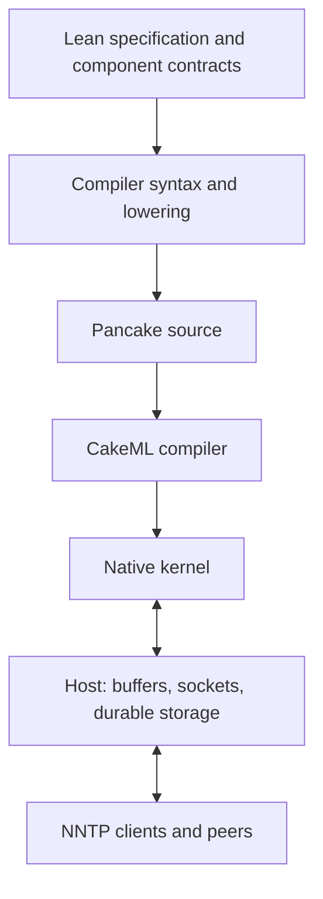

# Architecture

The intended application is an NNTP service; the reusable asset is a compiler and a small host boundary suitable for later integration into dregg. Keep the protocol state machine independent of an OS event loop, and keep article storage independent of the chosen network transport.

The diagram describes the intended path. Today the region-digest and byte-copy examples traverse syntax, source emission, compilation, and native execution. Their model proofs and runtime tests cover different portions of that path; they do not yet form one theorem.

| Layer | Current home | Boundary |
| --- | --- | --- |
| Component semantics and proofs | `lean/DN/Compiler` | Lean model of Pancake state, memory, locals, FFI oracle, and clock |
| Source emission | `DN.Compiler.Main`, `Checked`, `Syntax`, `Lower`, `Abi` | The checked exported profile — region, echo, render and the differential fixtures; unsupported shapes, calls and FFI are refused with a reason |
| Backend | `backend/`, `tools.lock.json` | Patched source proof lane and separate release compiler execution lane |
| Native ABI exercise | `native/`, `DN.Compiler.Abi` | Explicit 32-bit C results/full-word output slots; independent references |
| Reference TCP host | `native/echo_server.c` | Bounded single-threaded `poll`; generated byte-copy payload path |
| Host library | `crates/dn-runtime` | Bounded ownership primitives; no sockets yet |
| Concurrency models | `models/` | Small algorithms explored with Loom; separate from production code |
| Reactor models | `lean/DN/Dataplane` | Abstract invariants, not a verified connection to kernel completions |
| Preserved native implementation | `migration/dataplane` | Source for porting; old product integration remains visible |
| News specification seed | `lean/DN/News` | CRLF state across chunks; no command parser yet |

## Host contract to develop

Use bounded buffers and explicit lengths at the native boundary. A buffer identifier needs its generation and ownership state. Submission, completion, cancellation, and recycling are distinct events. Output progress must survive short writes; disconnect and error paths must release exactly the resources they own. Backpressure should stop new work before unbounded buffering becomes necessary.

An OS-specific adapter should translate real completions into a small protocol-neutral event vocabulary. The protocol step consumes a session state and bounded input, and returns output plus explicit storage/transport requests. This event vocabulary is a design target, not an interface already implemented here.

## Storage and offline exchange

An immutable article body with a stable Message-ID and separate group indexes is a promising starting point. Per-group article numbers and crossposts are not equivalent to filenames in a directory. Define transaction/recovery behavior before exposing posting success. Limits, retention, and policy belong beside the store contract.

NNTP transports commands over a reliable byte stream. Sneakernet needs an explicit batch export/import format and ingestion path; it is not supplied by a disconnected NNTP socket. Reuse the same validation and deduplication logic for network and offline ingestion. A 9P view can later expose the store without becoming its consistency mechanism.
